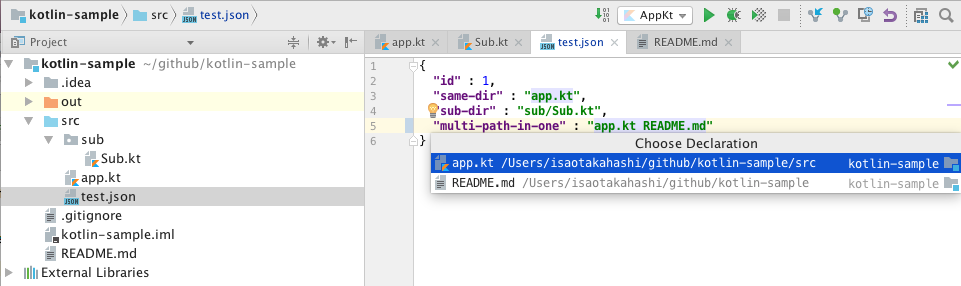
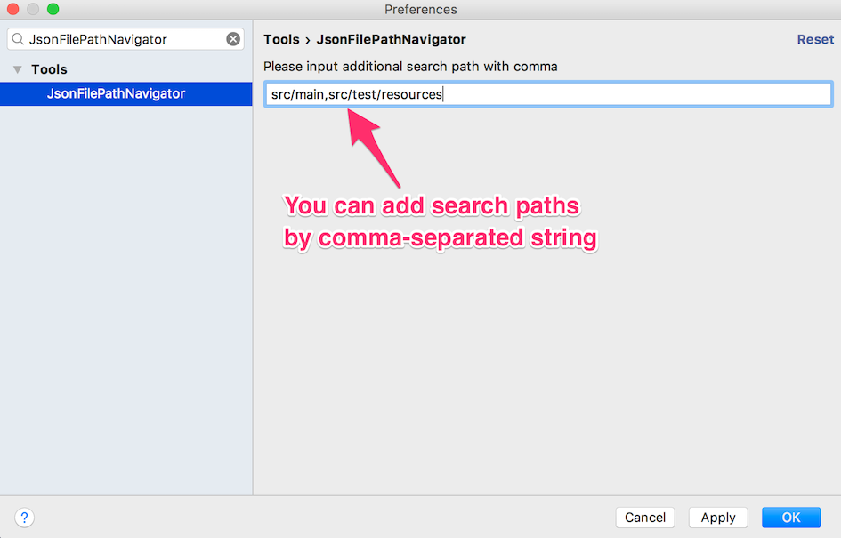

# JSON-File-Navigator
IntelliJ plugin for Navigating to project file from JSON string literal

## Overview
This is extension of **Navigate > Declaration** function.
The plugin searches file path in json string value and suggest matched files.

## Scoped Path
- Relative Path from Current File
- Relative Path from Project Root
- Relative Path from Customized Search Path  
  (Preference > Tools > JsonFilePathNavigator)
